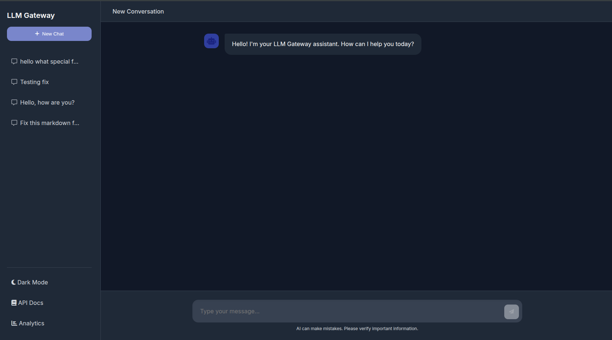
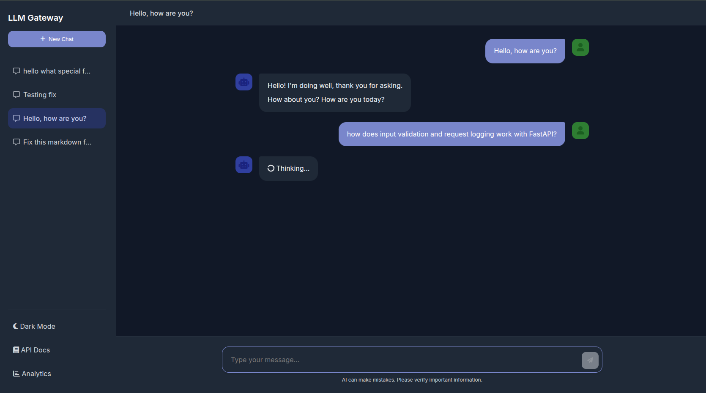
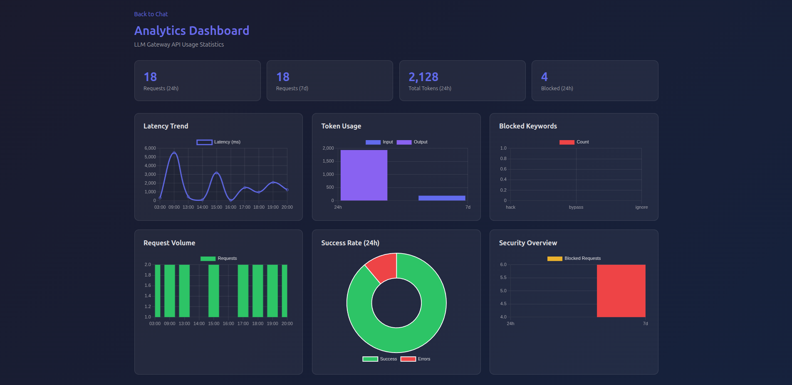
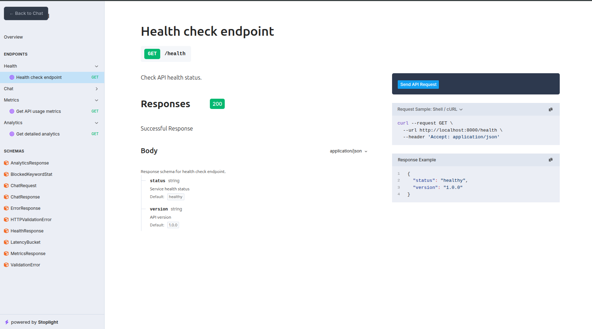

# LLM Gateway API

[](https://www.python.org/)
[](https://fastapi.tiangolo.com)
[](https://www.postgresql.org/)
[](https://www.docker.com/)
[](https://ai.google.dev/)
[](./LICENSE)

An enterprise-grade LLM gateway that proxies requests to Google's Gemini 2.5 Flash model with built-in input validation, structured output enforcement, and comprehensive request logging. Built for production scenarios where security, observability, and reliability actually matter.

---

## Why I Built This

As organizations increasingly integrate LLMs into their workflows, the gap between "making an API call" and "deploying a production-ready AI service" becomes starkly apparent. I built **LLM Gateway API** to bridge that gap—demonstrating that responsible AI deployment requires more than just connecting to an API endpoint. It requires input validation to prevent prompt injection, observability to understand usage patterns, and enterprise-grade infrastructure to ensure reliability. This project showcases how to build an LLM gateway that's ready for real-world deployment.

---

## Screenshots

Here's what the application looks like in action:

### Chat Interface



The main chat interface features a clean, dark-mode UI with session management and easy access to API docs and analytics.



Real-time chat responses from Gemini 2.5 Flash with markdown support and message history.

### Analytics Dashboard



Interactive analytics dashboard showing latency trends, token usage, request volume, success rates, and security metrics.

### API Documentation



Comprehensive API documentation with interactive testing capabilities powered by Stoplight Elements.

---

## Quick Start

### Prerequisites

Before you begin, make sure you have:

- **Docker** installed and running ([Get Docker](https://docs.docker.com/get-docker/))
- **Git** installed ([Get Git](https://git-scm.com/downloads))
- A **Google account** to get a free Gemini API key

Verify Docker is running:

```bash
docker --version
```

### Step 1: Get Your Gemini API Key

1. Go to [Google AI Studio](https://aistudio.google.com/apikey)
2. Sign in with your Google account
3. Accept the terms of service if prompted
4. Click **"Create API Key"** or **"Get API Key"**
5. Choose **"Create API key in new project"** (recommended for beginners)
6. Copy your API key (it starts with `AIza...`)

> **Note:** The free tier includes generous limits suitable for development and testing (1,500 requests/day). Keep your API key secure and never commit it to version control.

### Step 2: Clone the Repository

```bash
git clone https://github.com/hilliersmmain/llm-gateway-api.git
cd llm-gateway-api
```

### Step 3: Configure Environment Variables

Create your environment file from the example:

```bash
cp .env.example .env
```

Edit the `.env` file and add your Gemini API key:

```bash
nano .env
# or use your preferred editor: code .env, vim .env, etc.
```

Replace `YOUR_GEMINI_API_KEY` with the actual key you copied in Step 1:

```env
GEMINI_API_KEY=AIzaYourActualKeyHere
```

Save and close the file.

### Step 4: Start the Application

Launch the complete stack with Docker Compose:

```bash
docker-compose up -d --build
```

This will:

- Download the required Docker images (first time only)
- Build the application container
- Start PostgreSQL database and the API server
- Run in the background (`-d` flag)

**First-time startup** may take 2-3 minutes to download images and build.

### Step 5: Verify Installation

Check that the API is running:

```bash
curl http://localhost:8000/health
```

You should see: `{"status":"healthy","version":"1.0.0"}`

### Step 6: Access the Application

Open your browser and navigate to:

- **Chat Interface:** [http://localhost:8000](http://localhost:8000)
- **API Documentation:** [http://localhost:8000/docs](http://localhost:8000/docs)
- **Analytics Dashboard:** [http://localhost:8000/analytics?format=html](http://localhost:8000/analytics?format=html)

Try sending a message in the chat interface to confirm everything works!

### Stopping the Application

When you're done, stop the containers:

```bash
docker-compose down
```

To view logs if something goes wrong:

```bash
docker-compose logs -f
```

### Troubleshooting

**docker-compose command not found (Linux):**

```bash
sudo apt install docker-compose
```

**Port 8000 already in use:**

```bash
lsof -i :8000  # Find what's using the port
```

**Docker permission errors (Linux):**

```bash
sudo usermod -aG docker $USER  # Log out and back in after
```

**Invalid API key errors:**

- Double-check you copied the full key from Google AI Studio
- Ensure no extra spaces in `.env`
- Format: `GEMINI_API_KEY=AIzaYourKeyHere` (no quotes)

---

## Next Steps

Once you have the application running, here are some things to try:

**Explore the Features:**

- Send various types of messages in the chat to see how the AI responds
- Try creating multiple chat sessions using the sidebar
- Check the analytics dashboard to see your usage metrics
- Review the API documentation to understand available endpoints

**Test the Security Features:**

- Try sending messages with blocked keywords (check `app/services/guardrails.py` for the list)
- Monitor how the system logs blocked requests in the analytics

**Customize Your Setup:**

- Adjust rate limiting in `.env` (`RATE_LIMIT_REQUESTS`, `RATE_LIMIT_WINDOW_SECONDS`)
- Modify the guardrails rules in `app/services/guardrails.py`
- Add your own blocked keywords for content filtering

**Use the API Programmatically:**

```bash
# Test the chat endpoint
curl -X POST http://localhost:8000/chat \
  -H "Content-Type: application/json" \
  -d '{"message": "Hello, how are you?"}'

# Get usage metrics
curl http://localhost:8000/metrics

# Stream a response
curl -N -X POST http://localhost:8000/chat/stream \
  -H "Content-Type: application/json" \
  -d '{"message": "Tell me a story"}'
```

**Prepare for Production:**

- Review the "Deployment Considerations" section below
- Change the default database password in `.env`
- Consider setting up Redis for distributed rate limiting
- Review and customize security settings for your use case

---

## Key Features

**Security & Validation:**

- Input validation and guardrails to prevent prompt injection attacks
- Keyword-based content filtering with configurable blocklists
- Rate limiting (configurable per-user or global)
- IP tracking for security monitoring

**Observability:**

- Comprehensive request logging with PostgreSQL persistence
- Real-time metrics and analytics endpoints
- Interactive analytics dashboard with Chart.js visualizations
- Token usage tracking and cost estimation
- Success rate monitoring and error tracking

**Chat Interface:**

- Modern, responsive web UI with dark mode
- Multi-session chat history with localStorage persistence
- Markdown rendering for bot responses
- Real-time streaming responses via Server-Sent Events (SSE)

**Developer Experience:**

- Interactive API documentation with Stoplight Elements
- OpenAPI 3.0 spec generation
- Docker Compose for one-command deployment
- Comprehensive test suite with pytest

---

## API Endpoints

**Chat Endpoints:**

- `POST /chat` - Send a message through guardrails to Gemini
- `POST /chat/stream` - Stream response via Server-Sent Events (SSE)

**Monitoring & Metrics:**

- `GET /metrics` - Get usage statistics and estimated cost
- `GET /analytics` - Get detailed analytics with trends and charts
- `GET /analytics?format=html` - Interactive analytics dashboard
- `GET /health` - Health check endpoint

**Documentation:**

- `GET /docs` - Interactive Stoplight API documentation
- `GET /redoc` - ReDoc API documentation

---

## Analytics Dashboard

The `/analytics` endpoint provides detailed metrics and trends. Use `?format=html` for an interactive dashboard with charts for latency trends, token usage, blocked keywords, request volume, success rates, and security overview.

---

---

## Running Tests

```bash
pip install -r requirements.txt
pytest --cov=app
```

---

## Configuration

Key environment variables in `.env`:

- `GEMINI_API_KEY` - Your API key (required)
- `POSTGRES_PASSWORD` - Database password (change for production!)
- `RATE_LIMIT_REQUESTS` / `RATE_LIMIT_WINDOW_SECONDS` - Rate limiting settings
- `LOG_LEVEL` - Logging verbosity
- `REDIS_URL` - Optional for distributed rate limiting

---

## Deployment

Before deploying to production:

1. Change the database password in `.env`
2. Configure rate limiting for your traffic
3. Review guardrails in `app/services/guardrails.py`
4. Set up Redis for distributed rate limiting (optional)

Deploy to any Docker-compatible platform: AWS ECS, Google Cloud Run, Azure Container Instances, etc.

---

## Technology Stack

FastAPI • PostgreSQL 17 • Docker • Gemini 2.5 Flash • SQLAlchemy • Chart.js • Stoplight Elements

---

## License

MIT License - see [LICENSE](./LICENSE) for details.
