# LLM Gateway API

[](https://www.python.org/)
[](https://fastapi.tiangolo.com)
[](https://www.postgresql.org/)
[](https://www.docker.com/)
[](https://ai.google.dev/)
[](./LICENSE)

**LLM Gateway API** is an enterprise-grade LLM gateway that proxies requests to Google's Gemini 2.5 Flash model with built-in input validation, structured output enforcement, and comprehensive request logging. Designed for production scenarios where security, observability, and reliability are paramount.

---

### 🧬 Why I Built This

As organizations increasingly integrate LLMs into their workflows, the gap between "making an API call" and "deploying a production-ready AI service" becomes starkly apparent. I built **LLM Gateway API** to bridge that gap—demonstrating that responsible AI deployment requires more than just connecting to an API endpoint. It requires input validation to prevent prompt injection, observability to understand usage patterns, and enterprise-grade infrastructure to ensure reliability. This project showcases how to build an LLM gateway that's ready for real-world deployment.

---

## 🏗️ System Architecture

```mermaid
flowchart TB
    subgraph Client["Client Application"]
        A[HTTP Request]
    end

    subgraph Gateway["FastAPI Gateway"]
        B["/chat Endpoint"]
        C["🛡️ Guardrails Service"]
        D["🤖 Gemini Service"]
        E["📊 Logging Middleware"]
    end

    subgraph External["External Services"]
        F["Gemini 2.5 Flash API"]
        G[("PostgreSQL")]
    end

    A -->|POST /chat| B
    B --> C
    C -->|"❌ Blocked"| B
    C -->|"✅ Valid"| D
    D <-->|Generate| F
    D --> B
    B --> A
    E -.->|"Background Task"| G

    style C fill:#ff6b6b,color:#fff
    style D fill:#4ecdc4,color:#fff
    style E fill:#45b7d1,color:#fff
    style G fill:#96ceb4,color:#fff
```



---

## 🔑 Key Features

### 1. Enterprise Input Guardrails

- **Blocklist Filtering:** Rejects messages containing sensitive keywords (`secret_key`, `internal_only`) using regex word-boundary matching
- **Length Validation:** Prevents resource exhaustion by enforcing a 5,000 character limit
- **Extensible Architecture:** Easily add custom validation rules through the modular `GuardrailsService`

### 2. Production-Ready Observability

- **Request Logging:** Every API call is logged to PostgreSQL with full context
- **Token Tracking:** Input/output token counts for cost monitoring and optimization
- **Latency Metrics:** Sub-millisecond precision timing for performance analysis
- **Non-Blocking Writes:** Background task architecture ensures logging never impacts response times

### 3. Rate Limiting

- **IP-Based Throttling:** Configurable requests per minute per IP address (default: 10 req/min)
- **Pluggable Storage:** In-memory for single instances, Redis for distributed deployments
- **Proxy Support:** Respects `X-Forwarded-For` and `X-Real-IP` headers for accurate client identification
- **Graceful Responses:** Returns `429 Too Many Requests` with `Retry-After` header

### 4. Modern Async Architecture

- **Fully Async:** Built on FastAPI with async/await throughout
- **Connection Pooling:** SQLModel with asyncpg for efficient database connections
- **Graceful Lifecycle:** Proper startup/shutdown handling with lifespan context manager

---

## 📊 API Reference

| Endpoint   | Method | Description                                        |
| ---------- | ------ | -------------------------------------------------- |
| `/chat`    | POST   | Send a message through guardrails to Gemini        |
| `/metrics` | GET    | Get usage statistics and estimated cost            |
| `/health`  | GET    | Health check endpoint                              |
| `/docs`    | GET    | Interactive Swagger UI documentation               |
| `/redoc`   | GET    | ReDoc API documentation                            |

### Request Example

```bash
curl -X POST "http://localhost:8000/chat" \
  -H "Content-Type: application/json" \
  -d '{"message": "What is the capital of France?"}'
```

### Response Example

```json
{
  "content": "The capital of France is Paris.",
  "token_usage": {
    "input_tokens": 8,
    "output_tokens": 12
  }
}
```

### Metrics Endpoint

```bash
curl http://localhost:8000/metrics
```

```json
{
  "total_requests_today": 150,
  "total_tokens_in": 12500,
  "total_tokens_out": 45000,
  "estimated_cost_usd": 0.028875
}
```

### Rate Limit Response (429)

When rate limit is exceeded:

```json
{
  "detail": "Too many requests. Please try again later.",
  "error_type": "rate_limit_exceeded"
}
```

Response includes `Retry-After` header indicating seconds until the limit resets.

---

## 💻 Quick Start

**Prerequisites:** Python 3.12+, Docker

### Option 1: Docker (Recommended)

The easiest way to run the complete stack:

```bash
# Clone the repository
git clone https://github.com/hilliersmmain/llm-gateway-api.git
cd llm-gateway-api

# Configure environment
cp .env.example .env
# Edit .env and add your GEMINI_API_KEY

# Start the complete stack (API + PostgreSQL)
docker-compose up -d --build

# Verify it's running
curl http://localhost:8000/health
```

### Option 2: Local Development

For development with hot-reload:

```bash
# Clone the repository
git clone https://github.com/hilliersmmain/llm-gateway-api.git
cd llm-gateway-api

# Start PostgreSQL only
docker-compose up -d db

# Create virtual environment
python -m venv .venv
source .venv/bin/activate  # Windows: .venv\Scripts\activate

# Install dependencies
pip install -r requirements.txt

# Configure environment
cp .env.example .env
# Edit .env and add your GEMINI_API_KEY

# Run the server with hot-reload
uvicorn app.main:app --reload
```

Open browser to `http://localhost:8000` for the chat UI, or `/docs` for Swagger documentation.

---

## ⚙️ Configuration

All settings can be configured via environment variables or `.env` file:

| Variable                     | Default                         | Description                                 |
| ---------------------------- | ------------------------------- | ------------------------------------------- |
| `GEMINI_API_KEY`             | (required)                      | Google Gemini API key                       |
| `DATABASE_URL`               | `postgresql+asyncpg://...`      | PostgreSQL connection string                |
| `LOG_LEVEL`                  | `INFO`                          | Logging level (DEBUG, INFO, WARNING, ERROR) |
| `RATE_LIMIT_REQUESTS`        | `10`                            | Max requests per window per IP              |
| `RATE_LIMIT_WINDOW_SECONDS`  | `60`                            | Rate limit window duration in seconds       |
| `REDIS_URL`                  | (none)                          | Redis URL for distributed rate limiting     |
| `MAX_INPUT_LENGTH`           | `5000`                          | Maximum input message length                |

### Rate Limiting Configuration

By default, rate limiting uses an in-memory store suitable for single-instance deployments:

```bash
# .env
RATE_LIMIT_REQUESTS=10
RATE_LIMIT_WINDOW_SECONDS=60
```

For distributed deployments with multiple API instances, enable Redis:

```bash
# .env
REDIS_URL=redis://localhost:6379/0
```

Then uncomment the Redis service in `docker-compose.yml`.

---

## 🛠️ Technology Stack

| Component     | Technology         | Purpose                              |
| ------------- | ------------------ | ------------------------------------ |
| **Framework** | FastAPI 0.115+     | High-performance async web framework |
| **Database**  | PostgreSQL 17      | Production-grade request logging     |
| **ORM**       | SQLModel + asyncpg | Type-safe async database operations  |
| **LLM SDK**   | google-genai       | Official Gemini Python SDK           |
| **Config**    | pydantic-settings  | Environment-based configuration      |
| **Cache**     | Redis (optional)   | Distributed rate limiting            |
| **Container** | Docker Compose     | Local development infrastructure     |

---

## 📁 Project Architecture

```
llm-gateway-api/
├── app/
│   ├── core/
│   │   ├── config.py          # Pydantic settings configuration
│   │   └── database.py        # Async SQLModel engine setup
│   ├── models/
│   │   ├── schemas.py         # Request/response Pydantic models
│   │   └── log.py             # SQLModel database table
│   ├── services/
│   │   ├── gemini.py          # Gemini API client wrapper
│   │   └── guardrails.py      # Input validation service
│   ├── middleware/
│   │   ├── logging.py         # Request logging utilities
│   │   └── rate_limit.py      # IP-based rate limiting middleware
│   └── main.py                # FastAPI application entry point
├── docker-compose.yml         # PostgreSQL container configuration
├── requirements.txt           # Python dependencies
└── .env.example               # Environment template
```

---

## 🎯 Skills & Competencies Demonstrated

**Backend Engineering**

- Async Python with FastAPI and modern type hints
- RESTful API design with OpenAPI documentation
- Database modeling with SQLModel ORM
- Dependency injection and service patterns

**DevOps & Infrastructure**

- Docker containerization for local development
- Environment-based configuration management
- Production-ready application lifecycle handling

**AI/ML Engineering**

- LLM API integration with structured outputs
- Input validation and prompt safety
- Token usage monitoring and cost optimization

**Software Architecture**

- Clean separation of concerns (services, middleware, models)
- Non-blocking I/O patterns for observability
- Extensible guardrail framework design

---

## 👤 About the Developer

**Sam Hillier** — Undergraduate researcher with an interdisciplinary background bridging life sciences and artificial intelligence.

- 🎓 **Current:** B.S. Data Science, UNC Charlotte (Transitioning to B.S. Artificial Intelligence, Fall 2026)
- 🧠 **Minor:** Cognitive Science
- 🔬 **Background:** B.S. Biology (Cellular/Molecular concentration), Appalachian State University (2024-2025)

_Passionate about AI applications in neuroscience, human-computer interaction, and building the infrastructure that powers intelligent systems._

---

## 📄 License

MIT License
